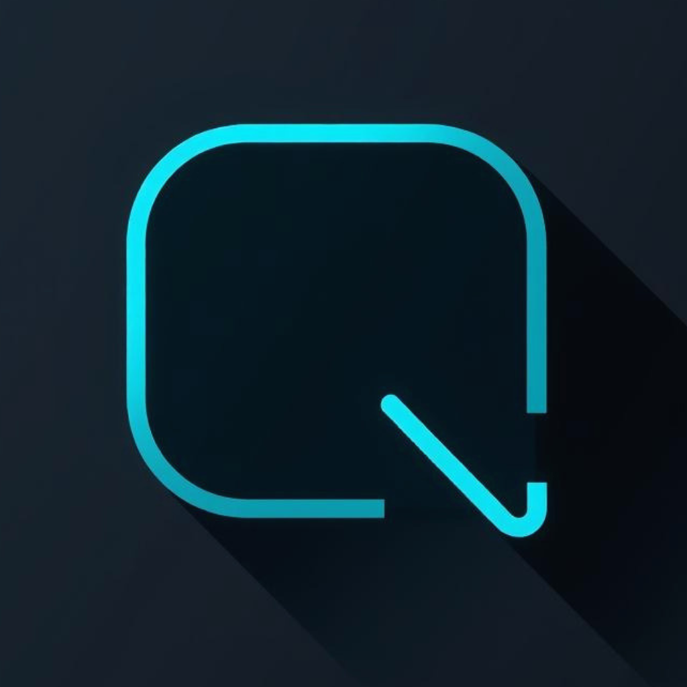
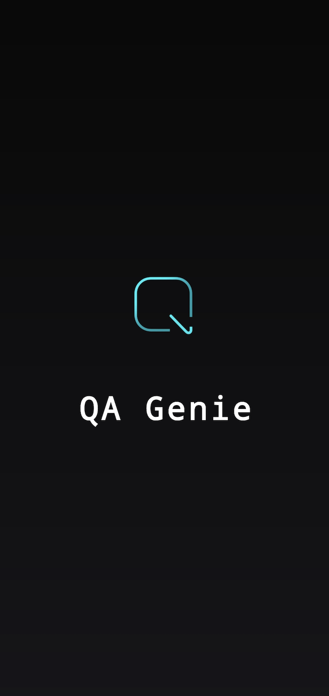
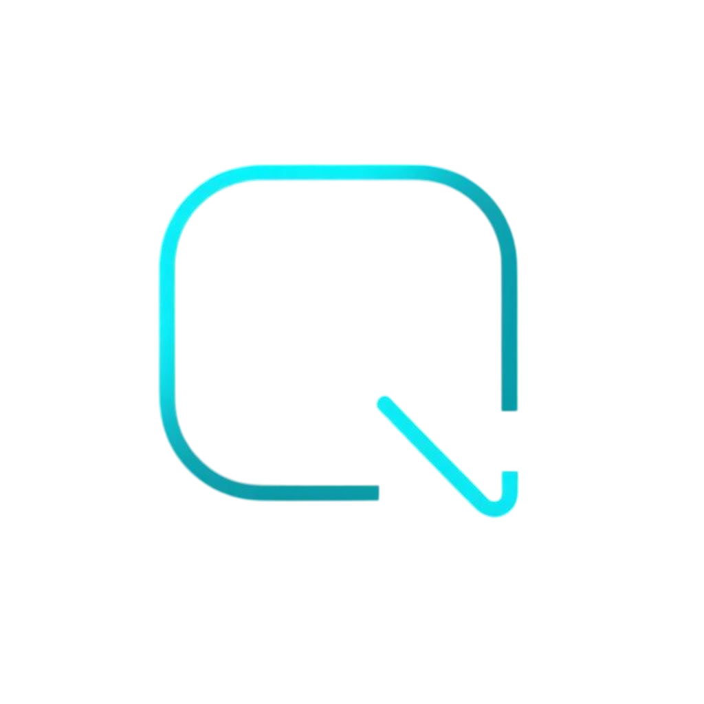

  

<h1 align="center">QA Genie Studio</h1>

  <strong>AI-Powered Test Case Generator for QA Engineers</strong> 
  Generate structured test cases from feature specs — export to Excel, Jira, Xray, Zephyr, and PDF.

  <a href="https://qagenies.com">Website</a> •
  <a href="https://play.google.com/store/apps/details?id=com.enaykumar.qagenie">Google Play</a>

---

## About

QA Genie Studio is an AI-powered test flow engine that generates structured, export-ready test cases from natural language feature descriptions. Built for QA engineers, testers, and developers who want to accelerate test coverage without writing cases from scratch.

### Key Features

- **AI Test Case Generation** — Describe a feature, get structured test cases with steps, expected results, and priority levels
- **Multi-Format Export** — Excel, Jira, Xray, Zephyr, CSV, JSON, and PDF
- **Test Suites** — Organize, manage, and track test cases across projects
- **Bug Reporting** — Document bugs with severity, environment details, and export capabilities
- **Guest & Account Modes** — Use without signing in, or create an account for full features
- **Freemium Model** — Core features free with rewarded ads, Pro tier for unlimited access

### Platform

- **Android** — Available on [Google Play](https://play.google.com/store/apps/details?id=com.enaykumar.qagenie)
- **Web** — Available at [qagenies.com](https://qagenies.com)

---

## Architecture

QA Genie Studio uses a clean, feature-based architecture:

- **Domain Layer** — Business entities and use cases
- **Data Layer** — Repositories and DTOs
- **Engine** — Core AI generation pipeline with deterministic fallback
- **Features** — Modularized feature modules (Auth, Generation, Monetization, Suites)
- **Backend** — Firebase Cloud Functions for quota enforcement and AI API integration

See [QA_Genie_Architecture.md](QA_Genie_Architecture.md) for the full technical overview.

---

## Documentation

| Document | Description |
|----------|-------------|
| [Architecture](QA_Genie_Architecture.md) | Technical architecture, data flows, and system design |
| [Structure](QA_Genie_structure.md) | Detailed project structure and module breakdown |
| [Manifesto](MANIFESTO.md) | The mission and principles behind QA Genie Studio |
| [Terms of Service](legal/TERMS_OF_SERVICE.md) | Legal terms for using the application |
| [AI Disclaimer](legal/AI_DISCLAIMER.md) | AI-generated content disclaimer |
| [Ads Policy](legal/ADS_MONETIZATION_POLICY.md) | Ad monetization and user experience policy |
| [Ownership Declaration](TSR_sign_out_79582.pdf) | Official ownership declaration document |

---

## Screenshots

  
  

---

## Copyright & License

Copyright (c) 2024-2026 Enaykumar. All rights reserved.

This software and its associated documentation, designs, and assets are proprietary. Unauthorized copying, distribution, modification, or use of this software, via any medium, is strictly prohibited.

See [LICENSE](LICENSE) for full terms.

---

## Contact

- **Website:** [qagenies.com](https://qagenies.com)
- **Email:** support@qagenies.com
